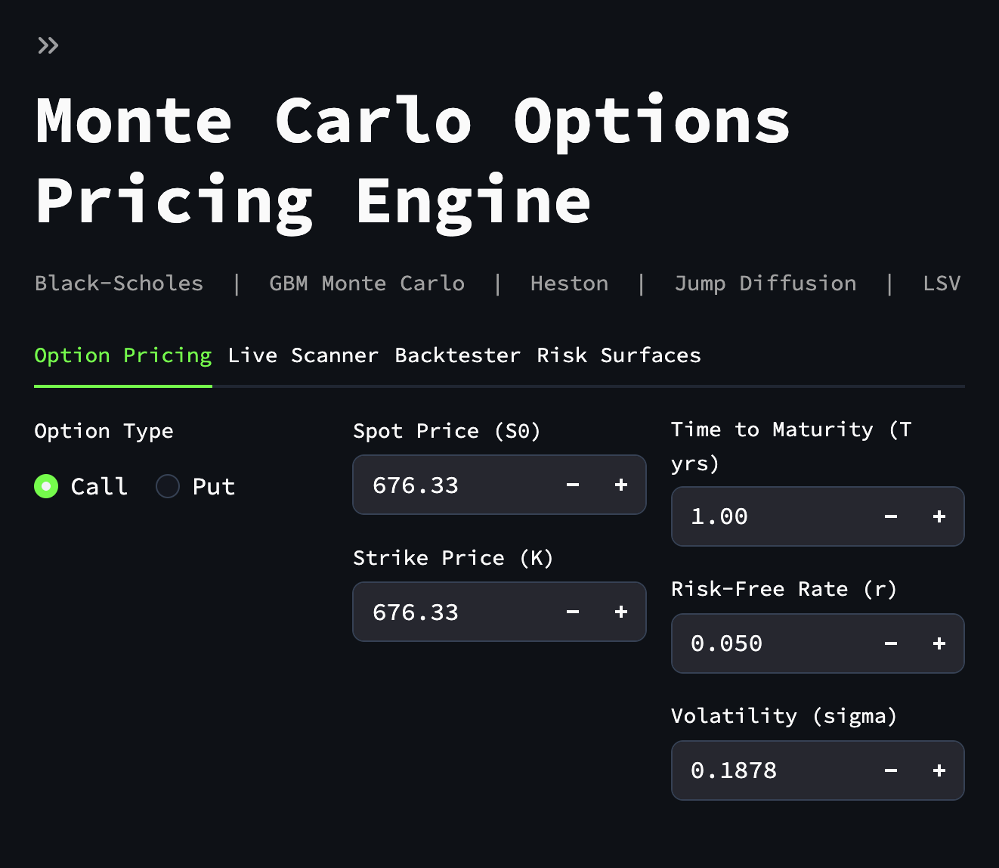
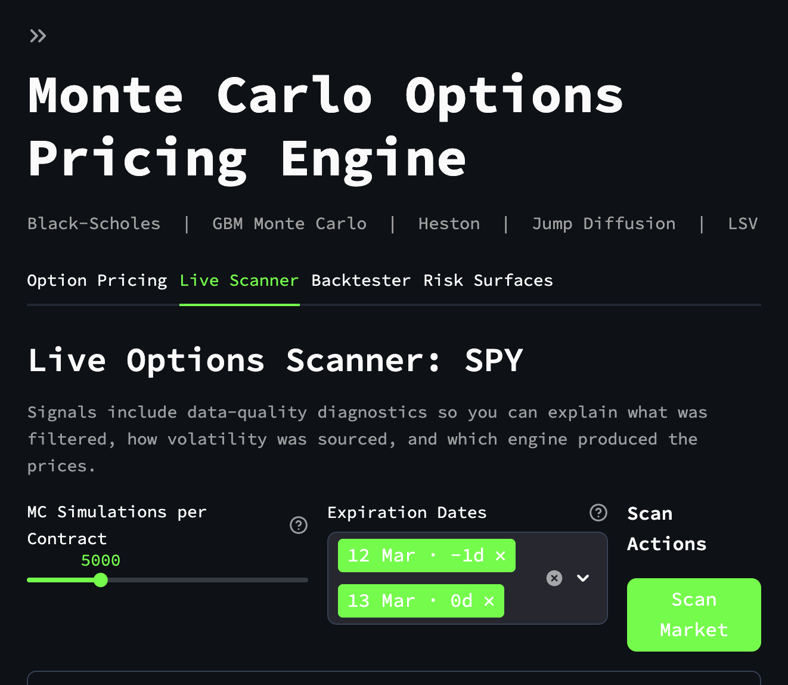
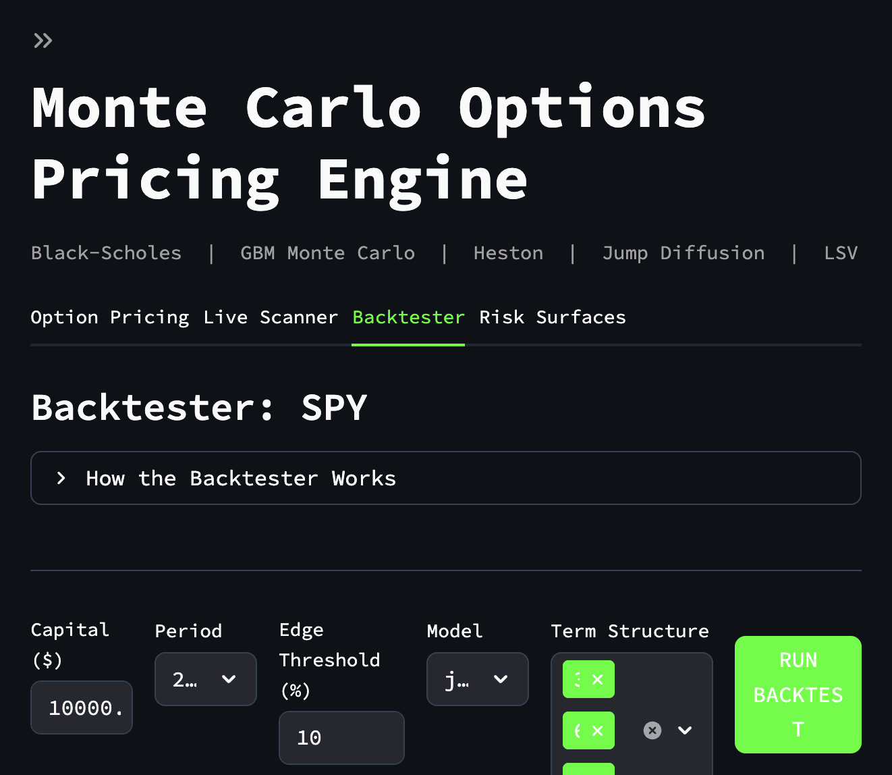

# Quant Terminal V2

Quant Terminal V2 is a research-oriented options analytics platform built around multiple pricing models, calibration workflows, a live scan pipeline, and a controlled backtesting environment. It is designed to demonstrate quantitative reasoning, model comparison, and engineering discipline rather than claim production trading readiness.

## What The Project Does

- Runs a research backtester that avoids look-ahead bias, applies delta hedging, and clearly discloses that it uses a Black-Scholes proxy entry price instead of historical option quote replay.
- Exposes the scanner through both a Streamlit interface and a FastAPI endpoint.
Captured screenshots are stored under [docs/screenshots](docs/screenshots).

### Option Pricing



### Live Scanner



### Backtester


## Why This Matters

The project is strongest when framed as a quantitative research platform:
- It distinguishes between model evidence and executable trading evidence.

That makes it much more defensible in front of judges than a project that overclaims predictive or trading realism.

## Main Components

- Streamlit frontend: [src/web/app.py](src/web/app.py)
- FastAPI backend: [src/api/main.py](src/api/main.py)
- Core pricing and calibration logic: [src/core](src/core)
- Validation suite: [tests](tests)
- Math guide: [docs/mathematical_foundations.md](docs/mathematical_foundations.md)
- Project map: [docs/project_map.md](docs/project_map.md)
- Run instructions: [RUN_GUIDE.md](RUN_GUIDE.md)

## Key Features

### 1. Multi-model pricing stack

- Black-Scholes provides the analytical benchmark.
- GBM Monte Carlo provides convergence and path intuition.
- Heston adds stochastic variance and skew/smile behavior.
- Jump Diffusion adds discontinuous crash dynamics and heavier tails.
- LSV adds a leverage surface intended to improve fit to the observed market surface.

### 2. Transparent live scanner

- Uses bid/ask crossing logic instead of midpoint fantasy fills.
- Quarantines ghost contracts, invalid quotes, extreme moneyness, short-dated contracts, and overly wide spreads.
- Returns diagnostics for filtered contracts, signal counts, and sigma-source counts.

### 3. Calibration layer

- Heston parameters are fitted to the live surface using weighted error minimization.
- LSV calibration constructs a leverage function from the implied volatility surface.

### 4. Research backtester

- Uses no-look-ahead volatility estimation.
- Applies daily delta hedging and transaction cost assumptions.
- Reports gross vs net effects through cost summaries and sensitivity analysis.
- Explicitly warns that results are controlled research evidence rather than historical option fill replay.

## Current Limitations

- Historical options NBBO data is not replayed in the backtester.
- The scanner depends on Yahoo Finance, which can return stale or incomplete quotes.
- LSV support is still best understood as an advanced research feature rather than a production-grade calibration stack.
- Calibration quality should be presented with humility; it improves realism but does not eliminate model risk.

## Validation Status

The repository includes tests around:

- jump diffusion martingale behavior
- Heston put-call parity and Fourier vs Monte Carlo consistency
- scanner routing and diagnostics return shape
- backtester disclosure and hedge-cost behavior
- calibration regression on a synthetic Heston surface

Representative test files:

- [tests/test_loki_remediation.py](tests/test_loki_remediation.py)
- [tests/test_scanner_regression.py](tests/test_scanner_regression.py)
- [tests/test_backtester_strategy_upgrades.py](tests/test_backtester_strategy_upgrades.py)
- [tests/test_calibration_regression.py](tests/test_calibration_regression.py)

## Getting Started

Install dependencies and run the frontend/backend using [RUN_GUIDE.md](RUN_GUIDE.md).

Quick start:

```bash
python3 -m venv .venv
source .venv/bin/activate
pip install -r requirements.txt
python3 -m uvicorn src.api.main:app --reload --port 8000
streamlit run src/web/app.py
```

If you run the API on a non-default port, set:

```bash
export QUANT_TERMINAL_SCAN_API_URL=http://127.0.0.1:<port>/scan
```
