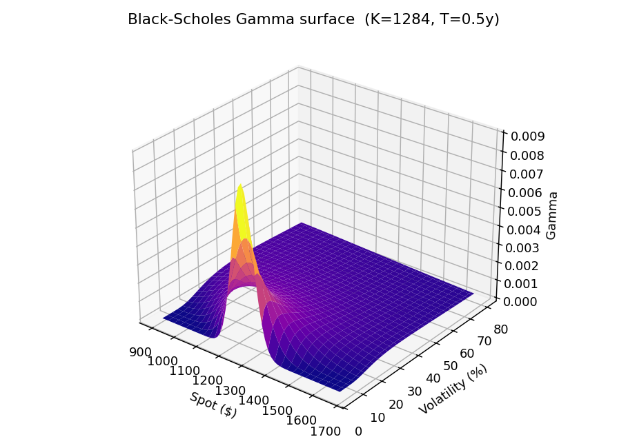

# Monte Carlo European Option Pricing Engine: A Multi-Model Quantitative Finance Platform

**Course:** IMCS 3020U — Integrated Application Project II

**Institution:** Ontario Tech University, Faculty of Science

**Date:** April 25, 2026

---

## Abstract

This report presents the design, implementation, and evaluation of a European option pricing platform built around five related valuation models: the Black-Scholes-Merton (BSM) analytical baseline, Geometric Brownian Motion (GBM) Monte Carlo, Heston Stochastic Volatility, Merton Jump Diffusion, and Local Stochastic Volatility (LSV). The system focuses exclusively on the pricing of European-style options—contracts that may only be exercised at expiration—which admit the closed-form and Monte Carlo solutions central to this work. The system demonstrates the synthesis of mathematical modelling and computer science by implementing each model's stochastic differential equations or analytical pricing formulas using vectorized numerical methods, wrapping them in an interactive Streamlit dashboard with a FastAPI backend, and validating them through convergence testing, calibration to live market data, and a delta-hedged historical backtesting framework. Live market data is sourced from Yahoo Finance via the yfinance library and the Polygon.io REST API, while historical backtesting uses end-of-day S&P 500 Index (SPX) option quotes from the Chicago Board Options Exchange (CBOE). The project illustrates how each successive model addresses specific limitations of its predecessor—constant volatility, absence of crash risk, and inability to fit observed implied volatility surfaces—while maintaining computational tractability through techniques such as Fourier-based analytical pricing and optional Numba JIT compilation.

---

## Table of Contents

1. Introduction
2. Background and Literature Review
3. Problem Definition
4. Methodology
5. System Architecture and Implementation
6. Mathematical Models
7. Computational Methods
8. Calibration and Validation
9. Results
10. Limitations and Future Work
11. Conclusion
12. References

---

## 1. Introduction

Options are financial derivatives whose value depends on an underlying asset's future price behaviour. This project focuses exclusively on **European-style options**—contracts that can only be exercised at the expiration date. This restriction is deliberate: European options admit closed-form analytical solutions (Black & Scholes, 1973; Merton, 1973) and straightforward Monte Carlo estimation via terminal price distributions, making them the natural setting for comparing model accuracy. The foundational Black-Scholes-Merton (BSM) model provides an elegant closed-form solution under the assumption of constant volatility. However, empirical evidence consistently demonstrates that volatility is neither constant nor deterministic—markets exhibit volatility smiles, skews, and clustering that the BSM framework cannot reproduce (Gatheral, 2006).

This project addresses that gap by implementing a progression of related European option pricing models, each relaxing a key assumption of its predecessor. The system is built as a usable research terminal—a web-based application that allows users to price European options, scan live markets for valuation discrepancies, validate model accuracy against observed quotes, and backtest model-driven trading strategies with realistic execution assumptions. The primary benchmark asset is the S&P 500 Index (^SPX), whose listed options are European-style, making it the ideal candidate for this framework.

The project integrates core mathematical principles—stochastic calculus, partial differential equations, numerical integration, and statistical estimation—with modern software engineering practices including vectorized computation, asynchronous API design, and modular architecture. This integration of mathematics and computer science is the central objective of IMCS 3020U.

---

## 2. Background and Literature Review

### 2.1 The Black-Scholes-Merton Framework

Black and Scholes (1973) derived a closed-form pricing formula for European options—options exercisable only at maturity—by assuming the underlying asset follows geometric Brownian motion (GBM) with constant drift and volatility. Merton (1973) independently extended this framework with a rigorous treatment of continuous-time finance. The BSM formula expresses the price of a European call option as:

$$C = S_0 e^{-qT} N(d_1) - K e^{-rT} N(d_2)$$

where $d_1 = \frac{\ln(S_0/K) + (r - q + \frac{1}{2}\sigma^2)T}{\sigma\sqrt{T}}$ and $d_2 = d_1 - \sigma\sqrt{T}$.

Despite its theoretical elegance, the BSM model's constant-volatility assumption is violated in practice, as evidenced by the volatility smile phenomenon observed across all major options markets (Hull, 2018).

### 2.2 Monte Carlo Simulation in Finance

Glasserman (2003) provides a comprehensive treatment of Monte Carlo methods in financial engineering. The core idea is to approximate the risk-neutral expectation $V_0 = e^{-rT}\mathbb{E}^{\mathbb{Q}}[\text{Payoff}(S_T)]$ by simulating a large number of terminal price scenarios and averaging the discounted payoffs. Monte Carlo methods are particularly valuable for path-dependent derivatives and models without closed-form solutions.

### 2.3 Stochastic Volatility Models

Heston (1993) proposed a stochastic volatility model in which the variance follows a Cox-Ingersoll-Ross (CIR) mean-reverting process. The model's key advantage is a semi-closed-form solution via Fourier inversion of the characteristic function, enabling efficient pricing without Monte Carlo simulation. The Heston model naturally generates volatility skew through the correlation parameter $\rho$ between the asset and variance Brownian motions.

### 2.4 Jump Diffusion Models

Merton (1976) extended the GBM framework by adding Poisson-distributed jump events to capture sudden, discontinuous price movements such as market crashes. The jump diffusion model produces heavier tails than GBM and can better price out-of-the-money put options, which serve as crash insurance.

### 2.5 Local Stochastic Volatility

Dupire (1994) introduced the concept of local volatility—a deterministic function $\sigma(S, t)$ that reproduces all observed European option prices exactly. The Local Stochastic Volatility (LSV) framework combines Dupire's local volatility with Heston's stochastic variance process through a leverage function $L(S, t)$, achieving both the realistic dynamics of stochastic volatility and exact calibration to the market surface (Gatheral, 2006).

### 2.6 Discretization and Simulation Schemes

Andersen (2008) developed efficient discretization schemes for the Heston model that preserve positivity of the variance process. The Feller condition $2\kappa\theta > \xi^2$ governs whether the variance process can reach zero; when violated, special numerical treatment is required.

---

## 3. Problem Definition

The core problem addressed by this project is: **How can progressively sophisticated mathematical models be implemented, validated, and deployed in an integrated system that demonstrates both theoretical understanding and practical computational competence?**

Specifically, the project tackles three sub-problems:

1. **Model Implementation**: Translating the stochastic differential equations and analytical pricing formulas of the model stack into efficient, numerically stable Python code.
2. **Validation and Calibration**: Verifying that Monte Carlo simulations converge to known analytical solutions, and calibrating model parameters to live market data.
3. **Practical Application**: Building a research terminal that applies these models to real-time market scanning, historical backtesting, and risk analysis—demonstrating the integration of mathematical theory with software engineering.

---

## 4. Methodology

The project follows a layered development methodology, progressing from simple to complex:

### 4.1 Model Evolution Strategy

Each model is implemented as a self-contained module, with explicit documentation of its mathematical foundation, assumptions, and limitations. All models price **European-style options exclusively**; early exercise is not supported. The progression is:

1. **BSM Analytical** → Baseline benchmark with closed-form European option solution
2. **GBM Monte Carlo** → Validates Monte Carlo convergence to BSM for European payoffs
3. **Heston Stochastic Volatility** → Addresses constant-volatility limitation
4. **Merton Jump Diffusion** → Addresses absence of crash risk
5. **LSV** → Addresses inability to fit observed volatility surfaces

### 4.2 Computational Approach

All simulations use vectorized NumPy operations to eliminate Python-level loops where possible. For models requiring path-level iteration (Heston, Jump Diffusion), optional Numba JIT compilation is employed to achieve near-C performance. The Heston model additionally implements Fourier-based analytical pricing for high-throughput scanning (~5 ms per option versus ~500 ms for Monte Carlo).

### 4.3 Data Sources

The system integrates multiple market data sources:

| Source | Data Type | Usage |
|--------|-----------|-------|
| Yahoo Finance (yfinance) | Live spot prices, historical closes, options chains, implied volatilities | Primary data feed for real-time scanning, pricing, and risk analysis (Yahoo Finance, n.d.) |
| Polygon.io REST API | Spot prices, historical daily closes, options reference metadata | Secondary/fallback provider for supported REST workflows (Polygon.io, n.d.) |
| S&P 500 Daily Options Data (Kaggle) | Daily EOD bid/ask quotes, implied volatility, Greeks, volume (2010–2023) | Historical backtester input via `combined_options_data.csv` (Singh, 2024; Cboe Global Markets, n.d.) |
| U.S. Treasury Bills (^IRX) | 13-week T-Bill yield | Risk-free rate proxy, fetched live via Yahoo Finance |

The yfinance library provides the primary options chain data, including strikes, expirations, bid/ask quotes, implied volatilities, volume, and open interest for all listed European-style SPX options. The Polygon.io API serves as an optional secondary provider for spot price history when an API key is configured. Historical backtesting uses the "S&P 500 Daily Options Data (2010–2023)" dataset published on Kaggle by Singh (2024), which contains CBOE end-of-day SPX option quote snapshots including bid, ask, implied volatility, delta, and volume fields across approximately 13 years of trading history.

### 4.4 Validation Framework

Model correctness is verified through:
- **Convergence tests**: Monte Carlo prices must converge to BSM analytical European option prices as path count increases
- **Statistical tests**: Terminal price distributions are tested against theoretical moments
- **Calibration**: Heston parameters are fitted to live implied volatility surfaces using constrained optimization (SLSQP)
- **Backtesting**: Model-driven trading strategies are tested against historical data with realistic execution assumptions

---

## 5. System Architecture and Implementation

### 5.1 Technology Stack

The system is implemented in Python 3.12+ using the following libraries:

| Component | Technology | Purpose |
|-----------|-----------|---------|
| Numerical Engine | NumPy ≥ 1.26, SciPy ≥ 1.11 | Vectorized simulation, optimization, integration |
| JIT Compilation | Numba (optional) | Near-C performance for path-level loops |
| Automatic Differentiation | JAX (optional) | Exact, noise-free Greeks via AD |
| Web Frontend | Streamlit ≥ 1.30 | Interactive dashboard with five analysis tabs |
| API Backend | FastAPI | Asynchronous options scanning endpoint |
| Visualization | Plotly ≥ 5.18 | Interactive 3D surfaces and charts |
| Market Data | yfinance ≥ 0.2.36, Polygon.io API | Live spot prices, European options chains (Yahoo Finance, n.d.; Polygon.io, n.d.) |

### 5.2 Module Architecture

The codebase is organized into three layers:

```
src/
├── core/                    # Mathematical engine
│   ├── black_scholes.py     # BSM analytical formula
│   ├── gbm_engine.py        # GBM Monte Carlo simulation
│   ├── heston_model.py      # Heston SV (MC + Fourier)
│   ├── jump_diffusion.py    # Merton Jump Diffusion
│   ├── lsv_model.py         # Local Stochastic Volatility
│   ├── greeks.py            # Option Greeks (AD + finite diff)
│   ├── calibration_engine.py# Heston + LSV calibration
│   ├── scanner_engine.py    # Batch valuation gap scanner
│   ├── backtester.py        # Historical + synthetic backtester
│   ├── model_evaluation.py  # Surface-fit diagnostics
│   ├── data_fetcher.py      # Market data with provider fallbacks
│   └── config.py            # Centralized configuration constants
├── api/
│   └── main.py              # FastAPI async scanning endpoint
└── web/
    ├── app.py               # Streamlit main application
    └── tabs/                # Five analysis tab modules
```

### 5.3 Frontend Design

The Streamlit dashboard provides five analysis tabs:

1. **Option Pricing**: Single-option pricing with path visualization and probability metrics
2. **Valuation Scanner**: Live market scanning for model-versus-market valuation gaps
3. **Model Validation**: Quote-based live model fit diagnostics (MAE, RMSE, NBBO coverage)
4. **Backtester**: Historical delta-hedged strategy backtesting with cost sensitivity analysis
5. **Risk Surfaces**: 3D vectorized Greek surfaces (Gamma, Vega) across spot and volatility

---

## 6. Mathematical Models

### 6.1 Black-Scholes-Merton

The BSM model prices **European options** by assuming the asset follows GBM under the risk-neutral measure:

$$dS_t = (r - q)S_t\,dt + \sigma S_t\,dW_t$$

The exact solution for terminal price is:

$$S_T = S_0 \exp\left((r - q - \tfrac{1}{2}\sigma^2)T + \sigma\sqrt{T}\,Z\right), \quad Z \sim N(0,1)$$

The implementation (`black_scholes.py`) computes $d_1$, $d_2$, and applies the cumulative normal distribution via `scipy.stats.norm.cdf`. Input validation ensures $T > 0$ and $\sigma > 0$ to prevent division by zero. The formula is valid exclusively for European options; American-style early exercise is not modelled.

### 6.2 GBM Monte Carlo Engine

The GBM engine (`gbm_engine.py`) generates $N$ terminal prices using the exact GBM solution and estimates the European option price as:

$$\hat{V}_0 = e^{-rT} \frac{1}{N}\sum_{i=1}^{N}\max(S_T^{(i)} - K, 0)$$

Because European options depend only on the terminal price $S_T$ and not on the path taken, the simulation need only generate $S_T$ values directly—full path simulation is provided separately for visualization purposes.

The implementation uses vectorized NumPy operations: random normals are generated in a single `np.random.randn(n_sims)` call, and the drift-diffusion calculation is applied element-wise. Full path simulation for visualization uses cumulative log-returns with `np.cumsum`.

### 6.3 Heston Stochastic Volatility

The Heston model (`heston_model.py`) evolves two coupled SDEs:

$$dS_t = (r - q)S_t\,dt + \sqrt{V_t}\,S_t\,dW_t^S$$
$$dV_t = \kappa(\theta - V_t)\,dt + \xi\sqrt{V_t}\,dW_t^V$$
$$\text{Corr}(dW_t^S, dW_t^V) = \rho$$

The implementation provides two pricing paths:

1. **Monte Carlo**: Euler-Maruyama discretization with full truncation scheme ($V_{\text{pos}} = \max(V, 0)$) to prevent negative variance. Correlated Brownian motions are constructed via Cholesky decomposition: $Z^V = \rho Z^S + \sqrt{1-\rho^2}Z^{\perp}$.

2. **Fourier Analytical**: The semi-closed-form solution via the characteristic function:
$$C = S_0 e^{-qT}P_1 - Ke^{-rT}P_2$$
where $P_j = \frac{1}{2} + \frac{1}{\pi}\int_0^{\infty}\text{Re}\left[\frac{e^{-iu\ln K}\phi_j(u)}{iu}\right]du$

The Fourier path is approximately 100× faster than Monte Carlo and is used by the scanner for batch pricing.

**Feller Condition**: The implementation explicitly checks $2\kappa\theta > \xi^2$ and surfaces the result in the UI, demonstrating awareness of model boundary conditions.

### 6.4 Merton Jump Diffusion

The Jump Diffusion model (`jump_diffusion.py`) extends GBM with Poisson jump arrivals:

$$dS_t = (r - q - \lambda\kappa_J)S_t\,dt + \sigma S_t\,dW_t + (e^Y - 1)S_t\,dN_t$$

where $N_t \sim \text{Poisson}(\lambda)$, $Y \sim N(\mu_J, \sigma_J^2)$, and $\kappa_J = e^{\mu_J + \frac{1}{2}\sigma_J^2} - 1$ is the risk-neutral jump compensator.

The compensator term is critical: without it, the process is not a martingale under the risk-neutral measure, which would distort expected discounted prices. The implementation includes the compensator in the drift adjustment.

### 6.5 Local Stochastic Volatility

The LSV model (`lsv_model.py`) modulates the Heston process with a leverage function:

$$dS_t = (r - q)S_t\,dt + L(S_t, t)\sqrt{V_t}\,S_t\,dW_t^S$$

The leverage function $L(K, T)$ is calibrated from the Dupire local variance surface:

$$\sigma_{\text{loc}}^2 = \frac{\partial w/\partial T}{1 - \frac{k}{w}\frac{\partial w}{\partial k} + \frac{1}{4}(-\frac{1}{4} - \frac{1}{w} + \frac{k^2}{w^2})(\frac{\partial w}{\partial k})^2 + \frac{1}{2}\frac{\partial^2 w}{\partial k^2}}$$

where $w(k, T) = \sigma_{IV}^2 T$ is total implied variance, $k = \ln(K/F)$ is log-moneyness, and $F = S_0 e^{(r-q)T}$ is the forward price of the underlying (Gatheral, 2006). The leverage function is then:

$$L(K, T) = \sqrt{\frac{\sigma_{\text{loc}}^2}{\mathbb{E}[V_t]}}$$

where $\mathbb{E}[V_t] = \theta + (V_0 - \theta)e^{-\kappa t}$ is the analytic Heston expected variance.

---

## 7. Computational Methods

### 7.1 Vectorized Simulation

All math is vectorized using NumPy per project standards. For example, the GBM terminal price simulation generates all $N$ paths in three vectorized operations:

```python
Z = np.random.randn(n_sims)
drift = (r - 0.5 * sigma**2) * T
S_T = S0 * np.exp(drift + sigma * np.sqrt(T) * Z)
```

### 7.2 JIT Compilation

For models requiring path-level iteration (Heston, Jump Diffusion), the `@njit(fastmath=True)` decorator from Numba compiles Python functions to optimized machine code. A graceful fallback ensures the system operates without Numba installed.

### 7.3 Automatic Differentiation for Greeks

Option Greeks (Delta, Gamma, Vega) are computed using JAX automatic differentiation when available:

```python
_jax_delta = jax.jit(jax.grad(bs_price_jax, argnums=0))
_jax_gamma = jax.jit(jax.grad(jax.grad(bs_price_jax, argnums=0), argnums=0))
```

This provides exact, noise-free Greeks without the numerical error inherent in finite-difference approximations.

### 7.4 Numerical Integration

The Heston Fourier pricer uses `scipy.integrate.quad` for numerical integration of the characteristic function over the domain $[10^{-4}, 200]$ with adaptive error control (`epsabs=1e-6`, `limit=100`).

### 7.5 Constrained Optimization

Heston calibration uses `scipy.optimize.minimize` with the SLSQP method and parameter bounds ($\kappa > 0$, $\theta > 0$, $\xi > 0$, $-1 < \rho < 0$, $V_0 > 0$) to minimize the weighted sum of squared IV errors against market-observed implied volatilities.

---

## 8. Calibration and Validation

### 8.1 Convergence Testing

The test suite (`tests/test_convergence_validation.py`) verifies that GBM Monte Carlo prices converge to BSM analytical prices. As the number of simulation paths $N$ increases, the Monte Carlo standard error decreases proportionally to $1/\sqrt{N}$, confirming correct implementation.

### 8.2 Heston Calibration Pipeline

The calibration engine (`calibration_engine.py`) performs the following steps:

1. Filter the options chain to liquid, near-the-money contracts (80%–120% moneyness)
2. Extract market implied volatilities and apply Gaussian ATM-centered weights
3. For each parameter vector $(\kappa, \theta, \xi, \rho, V_0)$, price all contracts via Fourier inversion
4. Back-solve model implied volatilities via binary search on BSM
5. Minimize weighted SSE using SLSQP with 500-iteration budget

### 8.3 IV Surface Construction

The `build_iv_surface` function interpolates scattered options chain data onto a regular $(K \times T)$ grid using `scipy.interpolate.griddata` with a fallback chain (linear → nearest). Gaussian smoothing ($\sigma = 0.5$) stabilizes the surface, and coverage metrics quantify data quality.

### 8.4 Live Model Validation

The model evaluation module (`model_evaluation.py`) computes quote-based fit metrics:
- **Price MAE/RMSE** versus quoted midpoint
- **IV MAE** versus quoted market implied volatility
- **NBBO coverage**: percentage of model prices falling within the bid-ask spread
- **Spread-normalized error**: model error expressed in units of the quoted spread

### 8.5 Backtesting Framework

The backtester (`backtester.py`) is used through the current application in **historical quote mode**, which uses actual SPX option bid/ask data from CSV with real market execution prices and the 100× contract multiplier. The codebase still contains an older synthetic proxy implementation for backward compatibility and internal experimentation, but the current user-facing workflow is historical-quote based.

The historical workflow enforces:
- **No look-ahead bias**: Volatility is computed strictly from data before the current date, with an assertion guard
- **Delta hedging**: Daily rebalancing of the underlying position to isolate volatility-driven P&L
- **Transaction costs**: Entry costs (5 bps), hedge rebalancing costs (1 bps), and slippage (1%)
- **Cost sensitivity analysis**: Final returns are reported under 0.5×, 1.0×, and 1.5× cost multiplier scenarios
- **Methodology disclosure**: The backtester explicitly labels its data sources and assumptions in the output

It also exposes the strategy controls used in Section 9.4: a **strategy side** (long volatility—buy options priced as cheap—or short volatility—sell options priced as rich), a **near-the-money selection policy** (moneyness band, expiry window, and an edge cap that rejects implausible deep-OTM signals), optional **per-entry calibration** (fitting Heston to each day's live surface so the fair value tracks the market smile), and a **per-trade position-size cap** expressed as a fraction of capital.

---

## 9. Results

### 9.1 Model Convergence

GBM Monte Carlo prices converge to the Black-Scholes-Merton analytical value ($10.4506$ for the reference at-the-money call: $S_0=K=100$, $T=1$, $r=0.05$, $\sigma=0.20$). The standard error falls as $O(1/\sqrt{N})$—dropping by a factor of $\sqrt{10}\approx 3.16$ for each tenfold increase in paths, from $0.46$ at $10^3$ paths to $0.015$ at $10^6$ (Table 1). Single-run absolute errors are noisier, since each row is one sampled path set, but remain within roughly two standard errors throughout, confirming the estimator is unbiased.

**Table 1: GBM Monte Carlo convergence to the BSM benchmark** (reference ATM call, BSM = $10.4506$).

| $N$ paths | MC Price | Abs Error | Std Error |
|---|---|---|---|
| 1,000 | 10.5461 | 0.0955 | 0.4557 |
| 10,000 | 10.4510 | 0.0004 | 0.1477 |
| 100,000 | 10.4472 | 0.0033 | 0.0464 |
| 500,000 | 10.4889 | 0.0383 | 0.0208 |
| 1,000,000 | 10.4628 | 0.0122 | 0.0147 |

### 9.2 Heston Calibration Quality

The two-stage global calibration—a low-discrepancy Sobol scan followed by an SLSQP polish in a realistic equity-index parameter box—fits the Heston parameters to a live SPX surface. On a representative stressed date (27 October 2011, spot 1284, drawn from the historical CBOE dataset), it reproduces the near-the-money implied-volatility level to roughly **2.4 volatility points** across the ATM band, with a weighted price-space SSE of $4.0\times10^{-3}$ over 40 subsampled contracts (Table 2). The strong negative spot–vol correlation ($\rho=-0.73$) is the expected equity-index leverage effect.

The fit is honest about its limits. A *single* Heston parameter set captures the overall volatility level and the negative-skew direction but cannot match the full steepness of the observed smile, and on this stressed surface the calibrated parameters violate the Feller condition ($2\kappa\theta-\xi^2 < 0$)—the variance process can reach zero. Figure 5 makes this visible: the model tracks the market near the money but flattens relative to the steep short-dated skew. This under-fit at the wings is precisely the theoretical motivation for the Local Stochastic Volatility extension (Section 9.5), whose leverage function corrects exactly this region.

**Table 2: Heston calibration to a live SPX surface** (27 October 2011, spot 1284).

| Metric | Value |
|---|---|
| Contracts used | 40 (subsampled from liquid chain) |
| $\kappa$ (mean reversion) | 0.82 |
| $\theta$ (long-run variance) | 0.0419 |
| $\xi$ (vol of vol) | 0.485 |
| $\rho$ (spot–vol correlation) | −0.731 |
| $V_0$ (initial variance) | 0.0423 |
| SSE (weighted, price space) | $4.0\times10^{-3}$ |
| ATM-band implied-vol MAE | 2.4 vol pts |
| Feller $2\kappa\theta-\xi^2$ | −0.17 (violated) |


### 9.3 Scanner Performance

The Fourier-based Heston pricer, using a fixed 128-node Gauss-Legendre rule, values a single option in roughly 0.1 ms—over four orders of magnitude faster than the 252-step Monte Carlo pricer—so an entire multi-hundred-contract chain is repriced in a fraction of a second, enabling interactive scanning. The scanner's bid-ask-aware signal logic (BUY when the model price exceeds the ask; SELL when it falls below the bid) eliminates the phantom edges that midpoint-only analysis produces, and, when calibration is enabled, prices against parameters fitted to the same surface so a reported gap is a genuine residual rather than a parameter mismatch.

Across the full 27 October 2011 surface (393 contracts spanning ±15% moneyness and multiple maturities), the calibrated model reprices with a price MAE of \$3.92 and an implied-volatility MAE of 4.7 volatility points; 56% of model prices fall inside the quoted bid–ask, and the mean absolute pricing error is 1.07× the quoted spread (Table 3). The full-surface IV error (4.7 pts) is larger than the near-the-money error (2.4 pts, Section 9.2) because it is dominated by the deep-wing and long-dated contracts the single Heston surface cannot fit—again pointing to LSV (Section 9.5).

**Table 3: Calibrated-model fit against live quotes** (27 October 2011 SPX surface, 393 contracts, ±15% moneyness).

| Metric | Value |
|---|---|
| Contracts evaluated | 393 |
| Price MAE | \$3.92 |
| Price RMSE | \$7.97 |
| IV MAE | 4.70 vol pts |
| Within NBBO | 56.2% |
| Mean abs error / spread | 1.07× |

### 9.4 Backtester Insights

The delta-hedged backtester produced a sequence of findings that, taken together, form the most instructive result of the project. All figures below use the historical SPX quote window available in the dataset (2010–2013), near-the-money contracts (\|moneyness − 1\| ≤ 7%, 20–75 days to expiry), a per-trade risk cap of 15% of capital, and daily delta rebalancing.

**The naive strategy fails, and not because of costs.** A long strategy that simply buys whatever the model prices as most underpriced loses roughly half of capital. Decomposing the profit and loss shows that transaction costs account for only a small fraction of the loss—removing all costs changes the result by under two percentage points. The true cause is contract selection: ranking candidates by *relative* percentage edge systematically selects deep out-of-the-money contracts (25–38% OTM in the observed trades), where a small volatility difference produces a large relative mispricing on a tiny premium. These "lottery ticket" contracts expired worthless.

**Near-the-money selection corrects the pathology but reveals a deeper one.** Restricting the universe to near-the-money contracts and rejecting implausible edges eliminates the lottery-ticket trades; the reported edges fall from 175–320% to a plausible 7–30%. The long strategy still loses (Table 4), because it is structurally *long* volatility: a delta-hedged long option pays the variance risk premium—implied volatility exceeds subsequently realized volatility on average—and delta hedging removes the directional upside that would otherwise mask it.

**Reversing the direction harvests that premium.** A short-volatility strategy—selling options the model prices as rich and delta-hedging—reverses the sign of the result. To confirm the profit is the variance risk premium and not a disguised directional bet in a rising market, the strategy was run on both calls and puts, whose delta hedges point in opposite directions (short calls hedge with long stock, short puts with short stock). Both are profitable, and short puts win 86% of trades *despite* their short-stock hedge working against the 2010–2013 rally—isolating the premium as the source of return. Short calls earn more than short puts precisely because their long-stock hedge additionally benefits from the market's upward drift, so the short-put result is the cleaner estimate of the pure premium.

**Table 4: Historical backtest by strategy side and option type** (near-ATM selection, 15% per-trade sizing, daily hedging, SPX 2010–2013).

| Strategy | Total Return | Sharpe | Win Rate |
|---|---|---|---|
| Long call | −71% | −0.38 | 17% |
| Long put | −3% | — | (1 trade) |
| Short call | +133% | 1.40 | 50% |
| Short put | **+45%** | **0.55** | **86%** |

**Two caveats keep this honest.** First, enabling per-entry calibration—fitting Heston to each day's live surface before pricing—largely removes the edge: once the model reproduces the market, the model-versus-market gap the strategy trades on collapses toward zero. The profit is therefore a *risk premium*, not a mispricing, consistent with an efficient market. Second, the 2010–2013 sample contains no major volatility spike, so it excludes exactly the tail event (a 2008- or 2020-style dislocation) that a short-volatility seller is compensated for bearing; the reported Sharpe ratios overstate the true risk-adjusted return. The application surfaces this warning directly in the backtester interface. The no-look-ahead guard, daily-rehedged accounting (which reconciles to the equity curve to the cent), and cost-sensitivity reporting remain in force throughout.

### 9.5 LSV Leverage Surface

The LSV calibration produces a leverage surface $L(K,T)$ that departs substantially from unity, most strongly at the strike wings where the Heston base model most under-fits (Figure 6). The surface is, however, visibly noisy: constructing the local-volatility correction requires Dupire-style finite differences of a discretely-sampled market implied-volatility surface, and that differentiation amplifies quote noise—especially at illiquid wing strikes and long maturities. This instability is why the LSV component is presented as a research-grade extension rather than a production calibration; a production implementation would require an arbitrage-free surface smoother (e.g. SVI/SSVI) before differentiation. The qualitative result nonetheless holds: the leverage correction is largest exactly where Section 9.2 showed the single Heston fit failing.


---

## 10. Limitations and Future Work

### 10.1 Current Limitations

1. **Heston Monte Carlo uses Euler-Maruyama discretization**, which can introduce bias when the Feller condition is near violation. More advanced schemes such as the Quadratic Exponential (QE) scheme (Andersen, 2008) would improve accuracy.

2. **The LSV leverage function uses nearest-neighbor interpolation** within JIT-compiled code due to Numba's restrictions on SciPy interpolation. Bilinear interpolation would improve smoothness.

3. **Market data dependency**: The system relies on yfinance for live options chains, which may experience rate limiting or data gaps during high-volatility periods.

4. **Historical quote coverage is concentrated on SPX** in the current user-facing backtester workflow, which limits cross-asset generalization.

### 10.2 Future Improvements

1. **Variance reduction techniques** (antithetic variates, control variates) to reduce Monte Carlo noise without increasing path count
2. **American option support** via Longstaff-Schwartz least-squares Monte Carlo
3. **Multi-asset correlation** for portfolio-level pricing and risk analysis
4. **GPU acceleration** using CuPy or JAX for massively parallel path simulation
5. **Extended backtester coverage** to additional tickers beyond SPX using historical options databases

---

## 11. Conclusion

This project demonstrates the integration of mathematical modelling and computer science in the domain of quantitative finance. By implementing a linked stack of option pricing models—BSM, GBM Monte Carlo, Heston Stochastic Volatility, Merton Jump Diffusion, and Local Stochastic Volatility—the system illustrates how each model addresses specific empirical limitations of its predecessor.

The mathematical contributions include implementations of stochastic calculus (SDEs for GBM, Heston, and Jump Diffusion), numerical integration (Fourier-based Heston pricing), constrained optimization (Heston calibration), and finite-difference PDE methods (Dupire local variance for LSV leverage calibration).

The computer science contributions include vectorized numerical computing, JIT compilation for performance-critical paths, automatic differentiation for exact Greeks, asynchronous API design, and a modular architecture that separates mathematical engines from presentation and data layers.

The system is deployed as a usable research terminal with five analysis tabs, demonstrating that the mathematical theory translates into practical analytical capability. The backtester's explicit methodology disclosure and the calibration engine's Feller condition checking exemplify the project's commitment to scientific honesty and awareness of model limitations.

---

## References

Andersen, L. (2008). Simple and efficient simulation of the Heston stochastic volatility model. *Journal of Computational Finance*, *11*(3), 1–42. https://doi.org/10.21314/JCF.2008.189

Black, F., & Scholes, M. (1973). The pricing of options and corporate liabilities. *Journal of Political Economy*, *81*(3), 637–654. https://doi.org/10.1086/260062

Cboe Global Markets. (n.d.). *Cboe Options Exchange: S&P 500 Index options (SPX)*. https://www.cboe.com/tradable_products/sp_500/

Dupire, B. (1994). Pricing with a smile. *Risk*, *7*(1), 18–20.

Gatheral, J. (2006). *The volatility surface: A practitioner's guide*. John Wiley & Sons.

Glasserman, P. (2003). *Monte Carlo methods in financial engineering*. Springer-Verlag.

Heston, S. L. (1993). A closed-form solution for options with stochastic volatility with applications to bond and currency options. *The Review of Financial Studies*, *6*(2), 327–343. https://doi.org/10.1093/rfs/6.2.327

Hull, J. C. (2018). *Options, futures, and other derivatives* (10th ed.). Pearson.

Merton, R. C. (1973). Theory of rational option pricing. *The Bell Journal of Economics and Management Science*, *4*(1), 141–183. https://doi.org/10.2307/3003143

Merton, R. C. (1976). Option pricing when underlying stock returns are discontinuous. *Journal of Financial Economics*, *3*(1–2), 125–144. https://doi.org/10.1016/0304-405X(76)90022-2

Polygon.io. (n.d.). *Polygon.io: Stock, options, and crypto market data APIs*. https://polygon.io/

Singh, S. (2024). *S&P 500 daily options data (2010–2023)* [Data set]. Kaggle. https://www.kaggle.com/datasets/shubhamcodez/s-and-p-500-daily-options-data-2010-2023

Yahoo Finance. (n.d.). *Yahoo Finance: Stock market live, quotes, business & finance news*. https://finance.yahoo.com/

---

## Appendix A: Application Screenshots

### Figure 1: Option Pricing Tab


### Figure 2: Live Valuation Scanner


### Figure 3: Backtester


### Figure 4: 3D Greek Surface



*(Figure 5, the Heston calibration versus market implied volatility, appears in Section 9.2.)*

---

## Appendix B: How to Run the System

### Environment Setup

```bash
python3 -m venv .venv
source .venv/bin/activate
pip install -r requirements.txt
```

### Running the Frontend

```bash
streamlit run src/web/app.py
```

Default port: 8501. Access at http://localhost:8501.

### Running the Backend API

```bash
python3 -m uvicorn src.api.main:app --reload
```

Default port: 8000. API docs at http://localhost:8000/docs.
